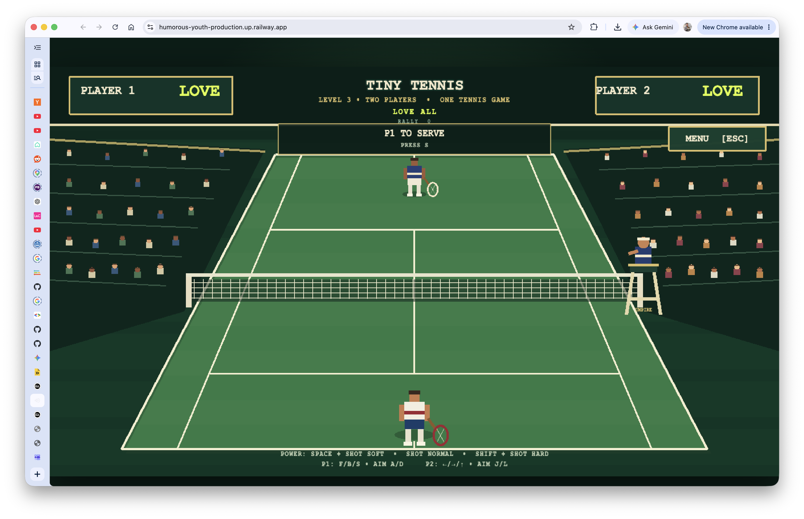

# IoT Tennis

Tiny Tennis is a browser tennis game controlled by keyboard today and by ESP32-S3 motion controllers when connected. The Arduino TinyML model is trained to classify the player's swing; the controller sends the classification and swing measurements to the game over a WebSocket.

## Authors:

Suyash Joshi & Murugesh Bellan



**LIVE GAME:** https://humorous-youth-production.up.railway.app/

## How everything fits together

```text
┌─────────────────────┐   WSS /ws   ┌────────────────────────┐   WebSocket room   ┌────────────────────┐
│ ESP32-S3 controller │ ───────────▶ │ Railway Node relay     │ ─────────────────▶ │ Browser Tiny Tennis│
│ trained TinyML IMU  │              │ serves game + routes   │                    │ Phaser game        │
│ forehand/backhand/  │              │ controller messages    │                    │ physics + scoring  │
│ serve + strength    │              └────────────────────────┘                    └────────────────────┘
└─────────────────────┘
```

The relay is transport only: it assigns controller 1/2 to a room, validates the payload, converts strength to `power`, and forwards the shot. The browser still keeps keyboard input enabled. Tennis physics, timing, collisions, misses, particles, audio and scoring stay in the game.

## What to give the Arduino developer

They need to wait for the Railway deployment URL. They do **not** need to be on the same Wi-Fi as the laptop or browser: both devices make outbound Internet connections to Railway. For local testing only, use the laptop's LAN IP and the same Wi-Fi.

Hosted endpoint:

```text
wss://YOUR-RAILWAY-DOMAIN/ws
```

Join one controller to Player 1 (use Player 2 for the other controller):

```json
{ "type": "join", "role": "controller", "room": "DEMO", "player": 1 }
```

For every recognized swing, send:

```json
{
  "type": "gesture",
  "gesture": "forehand",
  "strength": 82,
  "probability": 0.94
}
```

Allowed gestures are `forehand`, `backhand`, and `serve`. `strength` is `0–100`; `probability` is TinyML confidence `0–1`. Do not send a message for `still`. If Railway has `CONTROLLER_TOKEN` configured, include `"token":"..."` in the join message.

## Fast end-to-end test

1. Before deploying, make sure the root service files are committed: `package.json`, `package-lock.json`, `railway.json`, and `server/`. Railway builds committed Git contents, not uncommitted files on your laptop. Deploy this repository to Railway from the repository root (do not set the Railway root directory to `tiny-tennis`).
2. Railway uses `railway.json`: build `npm run build`, start `npm start`, health check `/health`.
3. Confirm `https://YOUR-RAILWAY-DOMAIN/health` returns JSON with `ok: true`.
4. Open `https://YOUR-RAILWAY-DOMAIN/?room=DEMO` in the game browser.
5. Connect the Arduino to `wss://YOUR-RAILWAY-DOMAIN/ws`, send the join JSON, then send a test forehand JSON. Player 1 should react in the browser.
6. Check the in-game top status line: it should change from `CONNECTING` to `CONNECTED`, then show the last player/stroke/power received.
7. Test backhand, serve, low/high strength, and a second controller using `player:2`.
8. If hardware is not ready, run the same flow locally with `npm install && npm run build && npm start`, open `http://localhost:8080/?room=DEMO`, and use keyboard controls.

For the full message examples and troubleshooting, see [`server/README.md`](server/README.md). The game itself is documented in [`tiny-tennis/README.md`](tiny-tennis/README.md).
